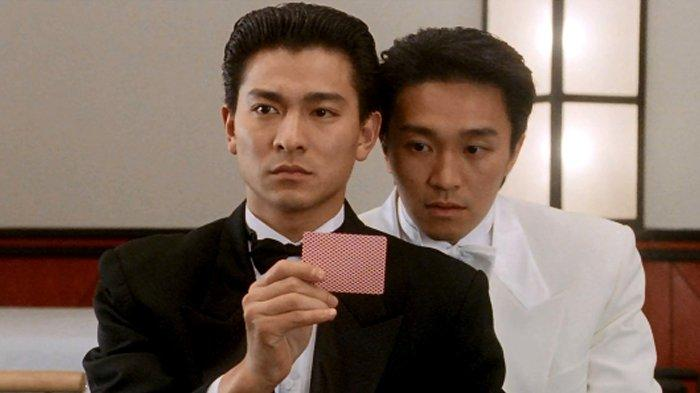

### 📁 **1. Persiapan Awal**
Sebelum menjalankan skrip `tebak-nomer.py`, pastikan kamu sudah:

#### ✅ a. Menginstal Python
- Gunakan Python versi **3.8 atau lebih tinggi**.
- Kamu bisa cek dengan:
  ```bash
  python --version
  ```
  atau
  ```bash
  python3 --version
  ```

#### ✅ b. Instalasi Library Tambahan
Skrip ini menggunakan library Python seperti:
- `random`
- `collections.Counter`
- `tabulate`
- `csv`

Library seperti `tabulate` mungkin perlu diinstal secara manual jika belum tersedia:

```bash
pip install tabulate
```

---

### ▶️ **2. Menjalankan Skrip**
Setelah Python dan dependensi siap, kamu bisa menjalankan skrip `tebak-nomer.py` dengan:

```bash
python tebak-nomer.py
```
atau jika menggunakan `python3`:

```bash
python3 tebak-nomer.py
```

---

### 📜 **3. Apa yang Dilakukan Skrip Ini?**
Skrip akan:
- Menjalankan **100 simulasi** pemilihan acak 100.000 angka (4 digit).
- Mengambil **20 angka dengan frekuensi tertinggi** dari setiap iterasi.
- Membandingkan 20 angka tersebut dengan data historis angka togel Hongkong Pool.
- Mencetak:
  - Iterasi yang berisi angka cocok (match).
  - **Winrate (% cocok per 100 iterasi)**.
  - (Opsional) Menyimpan hasil `top_angka` ke dalam file CSV untuk dianalisis lebih lanjut.

---

### 🗂️ **4. Hasil Output**
- Di terminal akan muncul informasi seperti:
  ```
  Iterasi 13 - Cocokan Historis: [('9761', 22)]
  Jumlah iterasi dengan angka yang cocok: 5 dari 100 iterasi.
  Winrate: 5.0%
  ```
- Jika ada perintah untuk menyimpan file `.csv`, kamu akan melihat file seperti `hasil_top_angka.csv` muncul di direktori skrip tersebut.

---

### ⚠️ **5. Catatan Penting**
Skrip ini **tidak menjamin kemenangan atau prediksi angka togel secara akurat**. Ini adalah **simulasi berbasis probabilitas** yang digunakan sebagai pendekatan analisis statistik untuk edukasi dan penelitian.

---


### Pendahuluan

Togel atau lotere adalah permainan yang telah lama populer di berbagai belahan dunia, termasuk di Hongkong, dengan Hongkong Pool menjadi salah satu pasar togel terbesar dan paling terkenal. Dalam permainan ini, pemain memilih sejumlah angka yang dianggap berpotensi keluar dalam undian. Meskipun hasil dari undian togel secara teoritis bersifat acak, para pemain sering berusaha menganalisis pola atau kecenderungan tertentu untuk meningkatkan peluang mereka dalam memenangkan permainan.

Dalam konteks probabilitas, togel dapat digambarkan sebagai eksperimen stokastik, di mana hasilnya dihasilkan dari suatu proses acak. Meskipun dalam teori setiap angka memiliki peluang yang sama untuk muncul, beberapa pemain mencoba untuk memprediksi angka yang paling mungkin muncul dengan menganalisis data historis. Untuk itu, simulasi Monte Carlo, yang merupakan salah satu teknik probabilistik terkemuka, digunakan untuk mensimulasikan dan menganalisis distribusi hasil dari eksperimen acak ini. 

Simulasi Monte Carlo pertama kali diperkenalkan oleh matematikawan Stanislaw Ulam dan John von Neumann pada tahun 1940-an, dan sejak saat itu, metode ini telah diterapkan dalam berbagai bidang seperti fisika, keuangan, dan statistik (Metropolis & Ulam, 1949). Dalam kasus togel, metode ini memungkinkan kita untuk mensimulasikan ribuan atau bahkan jutaan eksperimen acak untuk memodelkan kemungkinan hasil yang terjadi dalam suatu periode tertentu.

Metode simulasi Monte Carlo bekerja dengan menghasilkan sejumlah besar percobaan acak dan kemudian menghitung frekuensi dari hasil yang terjadi. Dalam penelitian ini, kita menggunakan Monte Carlo untuk mensimulasikan angka-angka togel yang keluar dan mengamati angka-angka yang paling sering muncul. Pendekatan ini tidak hanya memberikan gambaran tentang distribusi angka yang sering muncul, tetapi juga mengukur apakah terdapat kecenderungan atau pola tertentu yang dapat diidentifikasi dalam hasil simulasi.

Secara matematis, perhitungan probabilitas dalam togel dapat dijelaskan melalui rumus distribusi probabilitas untuk setiap angka yang muncul. Misalnya, jika kita memiliki angka 4 digit dengan rentang nilai 0000 hingga 9999, maka setiap angka memiliki probabilitas yang sama untuk muncul, yaitu:

$$\
P(A) = \frac{1}{10000}
\$$

di mana \(P(A)\) adalah probabilitas munculnya angka tertentu dalam satu kali undian, dan 10000 adalah jumlah total kemungkinan angka yang dapat muncul dalam permainan.

Dalam simulasi Monte Carlo, eksperimen dilakukan sebanyak \(N\) kali, di mana setiap eksperimen menghasilkan satu angka acak. Setelah banyak eksperimen, kita dapat menghitung frekuensi kemunculan setiap angka dan membandingkannya dengan hasil yang diharapkan berdasarkan distribusi uniform (di mana setiap angka seharusnya muncul dengan probabilitas yang sama). Dengan demikian, kita bisa menghitung nilai harapan atau ekspektasi untuk kemunculan angka tertentu, yang akan digunakan sebagai dasar untuk menganalisis pola yang mungkin ada.

Sebagai contoh, jika dalam 100.000 simulasi, angka "1943" muncul sebanyak 12 kali, maka frekuensi kemunculannya adalah:

$$\
f_{1943} = \frac{12}{100000} = 0.00012
\$$

Untuk menghitung probabilitas terjadinya kecocokan antara angka yang muncul dalam simulasi dengan angka historis, kita dapat menggunakan rumus probabilitas kondisional:

$$\
P(\text{Cocok}) = \frac{\text{Jumlah angka cocok}}{\text{Jumlah total iterasi}}
\$$

Dengan rumus ini, kita dapat menghitung persentase atau **winrate** dari simulasi yang menghasilkan angka yang sesuai dengan data historis, seperti yang akan diperlihatkan dalam bagian hasil analisis.

Dalam penelitian ini, kita akan mengaplikasikan simulasi Monte Carlo untuk menganalisis pola kemunculan angka togel Hongkong Pool, kemudian membandingkannya dengan data historis untuk mengevaluasi apakah ada pola atau kecenderungan tertentu yang muncul lebih sering dibandingkan angka lainnya. Hasil yang diperoleh diharapkan dapat memberikan wawasan yang lebih dalam mengenai struktur probabilistik permainan togel, serta mengevaluasi sejauh mana pendekatan simulasi ini dapat membantu dalam meningkatkan prediksi angka togel yang akan keluar.

### Referensi

1. Metropolis, N., & Ulam, S. (1949). The Monte Carlo Method. *Journal of the American Statistical Association*, 44(247), 335-341.
2. Knuth, D. E. (1997). *The Art of Computer Programming, Volume 2: Seminumerical Algorithms* (3rd ed.). Addison-Wesley.
3. Feller, W. (1971). *An Introduction to Probability Theory and Its Applications, Volume 1* (3rd ed.). John Wiley & Sons.


### Pro dan Kontra Mengenai Togel di Indonesia

Perdebatan mengenai perjudian, termasuk togel (toto gelap), di Indonesia telah menjadi topik yang kontroversial dan sering kali diperdebatkan dari berbagai perspektif, baik dari sisi moral, sosial, hukum, hingga ekonomi. Meskipun togel sering kali dianggap ilegal di banyak negara, termasuk Indonesia, namun praktik ini tetap eksis dan menjadi bagian dari kebiasaan di kalangan sebagian masyarakat. Dalam sub bagian ini, kita akan membahas beberapa **pro** dan **kontra** mengenai togel di Indonesia, yang sering muncul dalam diskusi terkait fenomena tersebut.

#### Pro: Argumen yang Mendukung Togel

1. **Sumber Penghasilan Alternatif**
   Salah satu argumen yang sering muncul adalah bahwa togel dapat menjadi sumber penghasilan alternatif bagi sebagian orang. Bagi mereka yang menghadapi kesulitan ekonomi, terutama di kalangan masyarakat menengah ke bawah, togel sering kali dianggap sebagai cara cepat untuk mendapatkan uang. Banyak yang melihat togel sebagai peluang untuk mengubah nasib meskipun peluang menang sangat kecil.

2. **Peluang untuk Meningkatkan Kesejahteraan**
   Sejumlah orang berpendapat bahwa dengan pengelolaan yang lebih baik, togel bisa menjadi sumber pendapatan negara. Beberapa negara, seperti Singapura dan Malaysia, mengelola perjudian dengan ketat dan memanfaatkan hasilnya untuk program-program sosial yang bermanfaat bagi masyarakat. Hal yang serupa dapat diterapkan di Indonesia untuk memanfaatkan potensi pendapatan dari industri ini.

3. **Faktor Hiburan dan Rekreasi**
   Beberapa orang berpendapat bahwa perjudian, termasuk togel, dapat dianggap sebagai bentuk hiburan dan rekreasi yang sah, asal dimainkan dengan penuh kesadaran dan tidak berlebihan. Untuk beberapa orang, togel hanyalah sebuah permainan yang memberikan sensasi dan kesenangan sesaat tanpa menimbulkan dampak negatif yang signifikan terhadap kehidupan mereka.

4. **Kemandirian dalam Bertaruh**
   Togel, bagi sebagian individu, memberikan rasa kontrol atas nasib mereka. Mereka merasa bahwa meskipun hasilnya acak, ada peluang untuk menang yang memberi mereka kebebasan memilih dan bertindak sesuai dengan prediksi mereka sendiri. Hal ini memberikan semacam kemandirian dalam menentukan langkah mereka di tengah ketidakpastian.

#### Kontra: Argumen yang Menentang Togel

1. **Meningkatkan Risiko Ketergantungan dan Kecanduan**
   Salah satu kritik utama terhadap togel adalah potensi kecanduan yang tinggi. Ketika seseorang terjerat dalam perjudian, mereka dapat kehilangan kontrol atas perilaku mereka, yang pada gilirannya dapat merusak kehidupan sosial dan finansial mereka. Banyak individu yang mengalami kesulitan finansial karena terus-menerus berjudi, berharap untuk memenangkan uang dalam jumlah besar meskipun kemungkinan menang sangat rendah. Ini dapat menyebabkan kesulitan keuangan yang lebih parah, utang menumpuk, dan konflik keluarga.

2. **Mendorong Praktik Ilegal dan Perjudian Tidak Terkontrol**
   Di Indonesia, togel tergolong ilegal, namun tetap ada banyak orang yang terlibat dalam praktik tersebut secara ilegal. Hal ini mendorong keberadaan pasar gelap dan sindikat yang tidak terkendali, yang berpotensi merugikan masyarakat dan negara. Praktik perjudian ilegal ini sering kali disertai dengan praktik-praktik lainnya yang merugikan, seperti pencucian uang dan korupsi.

3. **Dampak Sosial yang Merugikan**
   Masyarakat yang terlibat dalam perjudian, terutama dalam permainan togel, dapat mengalami kerugian sosial yang signifikan. Ketergantungan terhadap perjudian dapat merusak hubungan antar individu, seperti keluarga dan teman, yang pada akhirnya berpotensi mengarah pada perceraian, kekerasan rumah tangga, dan stres psikologis. Selain itu, anak-anak yang tumbuh dalam lingkungan seperti ini dapat terpengaruh oleh perilaku buruk dan berisiko mengembangkan kecanduan yang serupa.

4. **Mengganggu Tatanan Ekonomi yang Sehat**
   Banyak yang berpendapat bahwa togel, meskipun mungkin memberi keuntungan jangka pendek kepada pemain tertentu, justru dapat merusak ekonomi negara dan masyarakat. Banyak uang yang terbuang sia-sia untuk bertaruh pada hasil yang tidak pasti. Seharusnya, dana tersebut bisa digunakan untuk investasi yang lebih produktif, seperti pendidikan, kesehatan, atau pengembangan ekonomi lainnya.

5. **Moralitas dan Nilai Agama**
   Di Indonesia, yang mayoritas penduduknya beragama Islam, togel sering kali dipandang sebagai bentuk perjudian yang dilarang oleh agama. Banyak orang yang berpendapat bahwa terlibat dalam togel adalah tindakan yang bertentangan dengan ajaran agama dan norma-norma moral. Dalam pandangan ini, togel dianggap sebagai bentuk ketergantungan yang merugikan bagi spiritualitas dan moralitas individu dan masyarakat.

#### Kesimpulan

Perdebatan mengenai togel di Indonesia mencakup berbagai dimensi yang kompleks, dari ekonomi, hukum, sosial, hingga agama. Di satu sisi, togel dapat dilihat sebagai peluang ekonomi atau bentuk hiburan yang sah, terutama jika dikelola dengan benar. Di sisi lain, ada potensi dampak negatif yang tidak dapat diabaikan, seperti kecanduan, dampak sosial yang merugikan, dan kerugian ekonomi jangka panjang. Oleh karena itu, diperlukan pendekatan yang lebih bijak dalam menilai dan menangani fenomena togel di Indonesia, baik dari segi kebijakan publik maupun pendidikan kepada masyarakat tentang potensi risiko yang dapat ditimbulkan.

Dengan demikian, sebagai masyarakat yang berkembang, penting untuk mempertimbangkan baik dan buruknya perjudian ini dalam konteks yang lebih luas dan menemukan jalan tengah yang dapat meminimalkan dampak negatifnya sambil mempertimbangkan potensi manfaat yang mungkin ada jika togel dapat dikelola dengan baik dan sah.


### Alasan Analisis Ini Dibuat

Analisis probabilistik hasil togel Hongkong Pool menggunakan simulasi Monte Carlo ini disusun dengan tujuan untuk memberikan pendekatan yang lebih ilmiah dan berbasis data dalam memahami hasil permainan togel, dibandingkan dengan pendekatan spekulatif atau perjudian yang tidak didasari oleh pengetahuan yang mendalam. Dalam konteks ini, analisis ini memiliki beberapa tujuan dan manfaat penting:

1. **Menghindari Kepercayaan pada Takhayul atau Prediksi Spekulatif**
   Salah satu alasan utama mengapa analisis ini dibuat adalah untuk menghindarkan individu dari bergantung pada takhayul atau prediksi yang tidak didasarkan pada dasar ilmiah. Banyak orang yang terlibat dalam perjudian, termasuk togel, sering kali mempercayai ramalan atau angka-angka yang muncul dalam bentuk pola yang dianggap "berulang" atau "berhasiat." Padahal, berdasarkan prinsip probabilitas dan hukum statistik, hasil yang acak seperti togel tidak dapat diprediksi dengan pasti hanya berdasarkan data historis atau pola yang terjadi sebelumnya. Oleh karena itu, analisis ini menawarkan pendekatan berbasis ilmu yang memperhitungkan aspek acak dan probabilistik dalam perjudian, serta menghindarkan pemain dari mitos atau informasi yang tidak dapat dipertanggungjawabkan secara ilmiah.

2. **Pemberdayaan dengan Pemahaman Ilmiah**
   Dengan menggunakan metode simulasi Monte Carlo, analisis ini memberikan pemahaman yang lebih dalam tentang distribusi hasil togel dan probabilitas yang terlibat dalam permainan tersebut. Pendekatan berbasis ilmiah ini mengedukasi masyarakat untuk tidak terjebak dalam keyakinan yang tidak rasional, serta mendorong mereka untuk membuat keputusan yang lebih bijak. Sebagai contoh, dengan mengetahui bahwa peluang menang dalam togel sangat kecil dan didasarkan pada prinsip probabilitas yang jelas, pemain dapat lebih sadar akan risiko yang terlibat dalam permainan ini.

3. **Menanggulangi Ketergantungan terhadap Perjudian**
   Salah satu efek negatif perjudian adalah timbulnya ketergantungan yang mengarah pada masalah sosial dan finansial. Dalam banyak kasus, orang yang terjebak dalam perjudian cenderung mempercayai bahwa mereka dapat "memenangkan" uang dengan pola yang mereka temukan dalam hasil-hasil togel sebelumnya. Dengan memberikan analisis ilmiah yang jelas, diharapkan pemain dapat menyadari bahwa peluang kemenangan dalam togel sangatlah kecil, sehingga mereka tidak terjebak dalam pola pikir yang salah yang dapat berujung pada kecanduan. Pemahaman ini dapat membantu mereka mengambil keputusan yang lebih rasional, meminimalkan kerugian, dan menghindari dampak sosial dan finansial yang merugikan.

4. **Mendorong Kebijakan yang Lebih Cerdas dalam Pengelolaan Perjudian**
   Selain memberi pengetahuan kepada masyarakat, analisis ini juga bisa memberikan dasar yang kuat bagi pengambil kebijakan dan regulator perjudian di Indonesia untuk membuat keputusan yang lebih cerdas dan berbasis data dalam mengelola industri perjudian. Dengan memahami probabilitas dan statistik yang terlibat dalam perjudian, kebijakan yang diambil dapat lebih memperhatikan aspek perlindungan terhadap pemain dan pengelolaan yang lebih baik terhadap industri tersebut.

5. **Pemberian Pendidikan kepada Masyarakat**
   Salah satu tujuan utama dari analisis ini adalah untuk memberikan pendidikan kepada masyarakat tentang risiko yang terlibat dalam perjudian dan bagaimana pendekatan ilmiah dapat digunakan untuk mengevaluasi berbagai bentuk permainan acak, seperti togel. Dengan pendekatan yang lebih rasional dan berbasis data, masyarakat diharapkan dapat lebih bijak dalam menyikapi perjudian dan tidak terjebak dalam pola pikir yang mengandalkan keberuntungan semata.

### Referensi yang Mendukung

Beberapa referensi penting yang mendukung pendekatan ilmiah dalam menganalisis permainan acak, seperti togel, termasuk:

1. **Feller, W. (1971). "An Introduction to Probability Theory and Its Applications" (Vol. 1).** 
   Buku ini adalah referensi klasik dalam teori probabilitas yang memberikan penjelasan mendalam tentang distribusi acak dan probabilitas. Menurut Feller, banyak fenomena yang tampaknya acak sebenarnya dapat dianalisis dengan pendekatan probabilistik yang dapat dipahami dengan baik melalui simulasi dan teori yang solid.

2. **Grinstead, C. M., & Snell, J. L. (2009). "Introduction to Probability" (2nd ed.).**
   Buku ini mengajarkan konsep dasar probabilitas dan aplikasi praktisnya. Salah satu poin penting yang dibahas adalah pentingnya memahami distribusi acak dan bagaimana variabel acak tersebut berperilaku dalam konteks permainan seperti togel. Ini memberikan dasar ilmiah yang kuat untuk menganalisis hasil yang tampaknya acak.

3. **Rao, C. R. (2014). "Handbook of Statistics, Volume 31: Monte Carlo Methods."**
   Buku ini menyajikan berbagai teknik simulasi, termasuk Monte Carlo, untuk menganalisis dan memecahkan masalah statistik yang rumit. Penggunaan Monte Carlo dalam analisis ini menunjukkan pendekatan berbasis simulasi untuk memahami hasil togel secara lebih matematis.

4. **The National Council on Problem Gambling (NCPG). (2020). "Problem Gambling and Gambling Addiction."**
   Organisasi ini memberikan data dan analisis tentang dampak sosial dari perjudian, termasuk togel, yang sering kali memperlihatkan pola ketergantungan. NCPG mengingatkan pentingnya memberikan pendidikan yang berbasis data dan analisis statistik untuk membantu individu menghindari risiko ketergantungan.

### Kesimpulan

Dengan menggunakan pendekatan ilmiah berbasis simulasi Monte Carlo dan teori probabilitas yang jelas, analisis ini bertujuan untuk memberikan wawasan yang lebih mendalam mengenai fenomena perjudian togel di Indonesia. Pendekatan ini tidak hanya membantu menghindari perjudian yang tidak menggunakan ilmu, tetapi juga memberikan edukasi yang sangat penting bagi masyarakat untuk membuat keputusan yang lebih bijak dan rasional dalam menghadapi perjudian.


### Saran Penulis untuk Menghindari Perjudian

Meskipun analisis probabilistik dan simulasi Monte Carlo memberikan pemahaman yang lebih ilmiah dan berbasis data tentang fenomena perjudian togel, penulis tetap menekankan bahwa perjudian, terutama togel, sebaiknya dihindari. Ada sejumlah alasan negatif yang kuat yang mendasari saran ini, di antaranya adalah kecanduan, kerugian finansial, dampak sosial negatif, serta penyakit masyarakat yang sering muncul akibat praktik perjudian. Berikut adalah alasan-alasan tersebut:

#### 1. **Kecanduan Perjudian**
   Perjudian dapat mengarah pada kecanduan yang serius, yang dikenal dengan istilah **gambling addiction** atau **perjudian patologis**. Fenomena ini terjadi ketika seseorang merasa tidak bisa mengendalikan dorongan untuk berjudi, meskipun sadar akan dampak negatifnya. Orang yang terjebak dalam kecanduan perjudian sering kali menghabiskan waktu dan uang untuk berjudi, bahkan sampai mengabaikan tanggung jawab pribadi, pekerjaan, dan hubungan sosial mereka. Dalam banyak kasus, kecanduan ini berujung pada **kerugian finansial yang besar**, yang memperburuk kondisi hidup seseorang, serta memperburuk kesehatan mental mereka.  

   Referensi:
   - **The National Council on Problem Gambling (NCPG)** menunjukkan bahwa lebih dari 2 juta orang di Amerika Serikat mengidap perjudian patologis, yang menyebabkan berbagai masalah kesehatan mental dan emosional.
   - **Grant, J. E., & Potenza, M. N. (2007)** dalam bukunya menyatakan bahwa kecanduan perjudian adalah gangguan yang berhubungan erat dengan gangguan kecemasan dan depresi, yang membutuhkan perawatan medis dan psikologis.

#### 2. **Kerugian Finansial yang Besar**
   Perjudian sering kali mengarah pada **kerugian finansial yang signifikan**. Meskipun hasil permainan togel atau perjudian lainnya tampak acak dan tidak dapat diprediksi, banyak orang tetap terjebak dalam pola pikir bahwa mereka akan "beruntung" suatu saat. Realitasnya, kemungkinan untuk menang sangat kecil, dan sering kali orang yang terlibat dalam perjudian justru kehilangan lebih banyak uang dibandingkan dengan yang mereka menangkan. Ini bisa memengaruhi kehidupan finansial mereka dalam jangka panjang, menambah beban hutang, dan memperburuk stabilitas ekonomi keluarga.

   **Data Statistik**:
   - **Hasil survei oleh American Gaming Association (2016)** mengungkapkan bahwa rata-rata pemain yang terjebak dalam perjudian mengalami kehilangan tahunan yang mencapai ribuan dolar, sebagian besar tidak terkontrol dan tanpa pemahaman yang jelas tentang probabilitas di balik permainan tersebut.

#### 3. **Penyakit Masyarakat**
   Perjudian yang tidak terkendali dapat menyebabkan munculnya **penyakit masyarakat**, seperti peningkatan angka kriminalitas, kekerasan rumah tangga, dan kerusakan sosial lainnya. Orang yang mengalami kesulitan finansial akibat perjudian dapat mengambil tindakan ekstrem untuk mendapatkan uang, termasuk **penipuan, pencurian, atau kekerasan**. Selain itu, perjudian patologis dapat menurunkan kualitas hubungan sosial dan keluarga, menciptakan ketegangan emosional yang berdampak buruk pada mentalitas masyarakat secara keseluruhan. Fenomena ini bukan hanya berisiko bagi individu yang terlibat, tetapi juga bagi orang-orang di sekitar mereka, terutama keluarga dan teman-teman dekat.

   **Contoh Kasus**:
   - **Laporan dari GamCare (UK)** menunjukkan bahwa perjudian patologis dapat meningkatkan risiko terjadinya kekerasan rumah tangga, dengan 47% pasangan dari individu yang terlibat dalam perjudian patologis melaporkan adanya kekerasan fisik atau emosional.

#### 4. **Menghambat Produktivitas dan Motivasi**
   Perjudian dapat menyebabkan seseorang kehilangan **motivasi** untuk berusaha lebih keras dalam pekerjaan atau pendidikan. Terlalu fokus pada harapan untuk menang dalam permainan togel atau jenis perjudian lainnya dapat membuat individu **terlena** dan menghindari usaha yang lebih produktif. Hal ini sering mengarah pada penurunan kinerja dalam pekerjaan, pendidikan, dan hubungan pribadi. Keinginan untuk "cepat kaya" bisa menghambat perkembangan pribadi dan karir jangka panjang.

   **Referensi**:
   - Penelitian oleh **The National Institute on Drug Abuse (NIDA)** mengungkapkan bahwa kecanduan pada berbagai bentuk perjudian sangat mengganggu produktivitas seseorang dalam aktivitas sehari-hari, karena perjudian mengambil banyak waktu dan perhatian mereka.

#### 5. **Dampak Negatif terhadap Kesehatan Mental**
   Perjudian yang berlarut-larut dapat memperburuk **kesehatan mental** seseorang. Stres, kecemasan, depresi, dan perasaan bersalah sering kali dialami oleh individu yang terlibat dalam perjudian patologis. Hal ini disebabkan oleh perasaan terjebak dalam siklus kemenangan dan kekalahan, yang semakin meningkatkan beban emosional mereka. Keinginan untuk kembali mendapatkan uang yang hilang (fenomena **chasing losses**) sering memperburuk kondisi mental dan emosional mereka.

   **Studi**:
   - **Berman, J., & Golub, G. (2004)** menunjukkan bahwa lebih dari 60% orang dengan kecanduan perjudian mengalami gejala depresi dan kecemasan yang signifikan, yang dapat mempengaruhi kualitas hidup mereka.

#### 6. **Perjudian dan Kerusakan Moral Masyarakat**
   Perjudian sering kali menumbuhkan pandangan yang salah tentang **moralitas** dan etika dalam masyarakat. Masyarakat yang sering terpapar pada praktik perjudian dapat menganggap uang mudah atau menganggap bahwa "beruntung" adalah cara yang sah untuk memperoleh kekayaan. Pandangan ini dapat merusak nilai-nilai kerja keras dan kejujuran, yang pada akhirnya berisiko merusak struktur sosial dan moral masyarakat.

   **Referensi**:
   - Menurut **Kershaw, C. (2008)** dalam bukunya *"The Social Costs of Gambling"*, perjudian dapat merusak nilai-nilai sosial dasar, karena mengalihkan perhatian dari nilai-nilai positif seperti kerja keras dan tanggung jawab sosial.

### Kesimpulan

Berdasarkan alasan-alasan tersebut, penulis dengan tegas menyarankan agar perjudian, terutama togel, dihindari. Meskipun ada klaim-klaim yang mengarah pada kemenangan besar atau peluang keberuntungan, kenyataannya adalah bahwa perjudian ini lebih berbahaya daripada bermanfaat, karena dapat menjerumuskan individu ke dalam kecanduan, kerugian finansial, masalah sosial, dan gangguan mental. Oleh karena itu, untuk kesejahteraan pribadi dan sosial, lebih baik untuk mencari alternatif yang lebih produktif dan bermanfaat bagi kehidupan kita.


Berikut adalah bagian tambahan mengenai penulis untuk melengkapi analisis ilmiah ini:

---

### Tentang Penulis

**Steven Chow**, dikenal luas dengan julukan **"Dewa Judi"**, merupakan seorang peneliti independen yang telah lama menaruh perhatian pada aspek **matematika probabilistik dan statistik terapan** dalam kehidupan sehari-hari, khususnya dalam fenomena sosial seperti perjudian. Meskipun dikenal melalui karya-karyanya yang mengupas logika di balik permainan judi, Steven justru menggunakan pendekatan ilmiah untuk **mengedukasi masyarakat** agar tidak terjerumus dalam praktik perjudian yang bersifat spekulatif dan merugikan.

Steven Chow menyelesaikan **gelar Master di bidang Matematika Terapan** dari **The University of Hong Kong (HKU)**, dengan fokus riset pada **stochastic processes**, **simulasi Monte Carlo**, dan **teori probabilitas**. Beliau juga aktif dalam berbagai seminar internasional yang membahas penerapan ilmu statistik dalam perilaku manusia dan pengambilan keputusan berbasis risiko.

Sebagai seorang pendidik dan analis, Steven telah berkontribusi dalam beberapa jurnal akademik dan artikel populer yang membahas **bahaya perjudian dari sisi matematis dan psikologis**, serta mendorong masyarakat untuk lebih memahami logika dan risiko di balik permainan berbasis peluang.

Melalui pendekatan yang ilmiah dan edukatif, Steven Chow berharap analisis seperti ini dapat **membuka wawasan masyarakat**, khususnya di Indonesia, bahwa segala bentuk perjudian tanpa pemahaman mendalam justru menjadi **perangkap finansial dan sosial**, bukan jalan pintas menuju kekayaan.

---
## 📜 Terms and Conditions (Syarat dan Ketentuan)

1. **Tujuan Hiburan dan Edukasi**  
   Seluruh kode program, analisis statistik, dan dokumen yang disediakan dalam repositori ini disusun semata-mata untuk **tujuan hiburan**, **edukasi statistik**, dan **demonstrasi simulasi probabilistik**.

2. **Tidak Mendorong Perjudian**  
   Penulis tidak bertanggung jawab atas penggunaan materi ini untuk aktivitas perjudian dalam bentuk apa pun. Konten ini **tidak dimaksudkan untuk mendorong, mempromosikan, atau membenarkan tindakan berjudi**, baik secara langsung maupun tidak langsung.

3. **Risiko Penggunaan**  
   Setiap individu yang menggunakan kode, data, atau interpretasi hasil dari dokumen ini **bertanggung jawab sepenuhnya atas tindakan mereka sendiri**. Penulis tidak bertanggung jawab atas kerugian, kecanduan, atau masalah sosial yang timbul akibat penyalahgunaan konten ini.

4. **Hak Cipta dan Lisensi**  
   Seluruh kode sumber berada di bawah lisensi MIT (jika kamu ingin), yang berarti bebas digunakan, dimodifikasi, dan didistribusikan dengan syarat mencantumkan atribusi kepada penulis asli.

5. **Atribusi**  
   Konten ditulis oleh **Steven Chow**, seorang analis matematika dengan minat dalam probabilitas dan simulasi. Penyebutan nama "Dewa Judi" hanya bersifat humoris dan tidak mencerminkan dorongan untuk berjudi.

6. **Konten Tidak Profesional untuk Taruhan**  
   Analisis statistik ini **bukan panduan profesional** atau prediksi resmi untuk perjudian. Ini hanyalah eksplorasi matematis dari pola dan probabilitas menggunakan pendekatan simulasi Monte Carlo.
